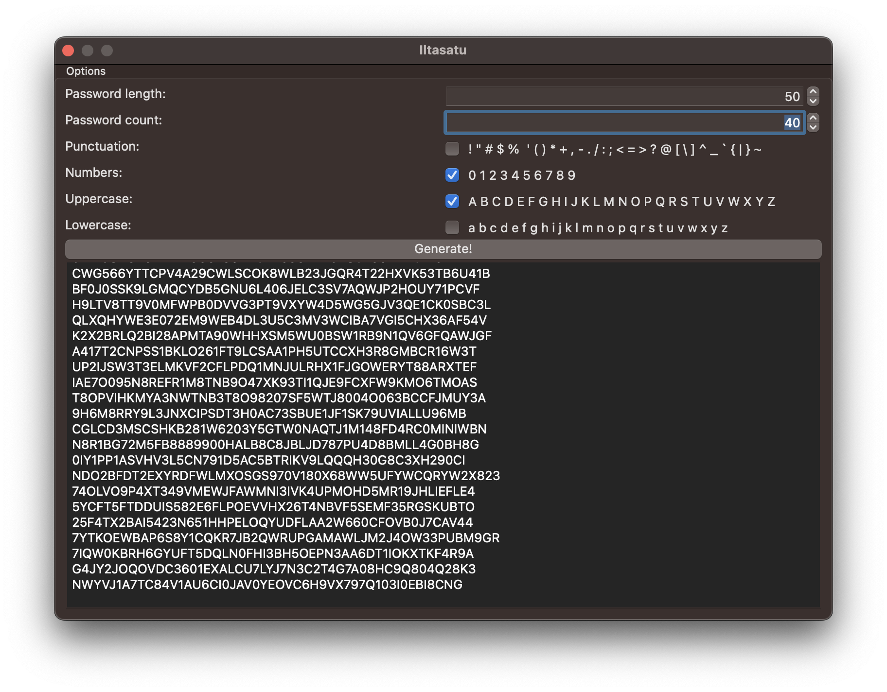

# iltasatu

- PRNG kludge...
	- The aim is/was to generate passwords or globs of random data (via the CLI)
	- Needs a lot of testing...

## TODO:

- Add option to seed the PRNG using std::seed_seq

	
	<b><i>Iltasatu GUI running on macOS (Ventura)</i></b>

